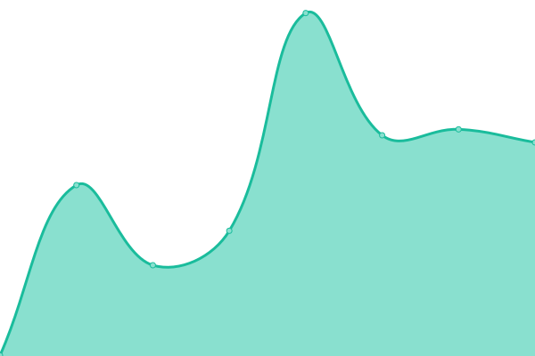

# [📈 Live Status](https://demo.upptime.js.org): <!--live status--> **🟩 All systems operational**

This repository contains the open-source uptime monitor and status page for [Upptime](https://upptime.js.org), powered by [Upptime](https://github.com/upptime/upptime).

With [Upptime](https://upptime.js.org), you can get your own unlimited and free uptime monitor and status page, powered entirely by a GitHub repository. We use [Issues](https://github.com/upptime/upptime/issues) as incident reports, [Actions](https://github.com/Live-Story/status/actions) as uptime monitors, and [Pages](https://demo.upptime.js.org) for the status page.

<!--start: status pages-->
<!-- This summary is generated by Upptime (https://github.com/upptime/upptime) -->
<!-- Do not edit this manually, your changes will be overwritten -->
<!-- prettier-ignore -->
| URL | Status | History | Response Time | Uptime |
| --- | ------ | ------- | ------------- | ------ |
|  [PROD LiveStory Site](https://www.livestory.nyc) | 🟩 Up | [prod-live-story-site.yml](https://github.com/Live-Story/status/commits/HEAD/history/prod-live-story-site.yml) | 

 616ms
     
 | 

<a href="https://Live-Story.github.io/status/history/prod-live-story-site">100.00%</a>
    

|  [DEV LiveStory console dev](https://console-dev.livestory.io/#/login) | 🟩 Up | [dev-live-story-console-dev.yml](https://github.com/Live-Story/status/commits/HEAD/history/dev-live-story-console-dev.yml) | 

 567ms
     
 | 

<a href="https://Live-Story.github.io/status/history/dev-live-story-console-dev">100.00%</a>
    

|  [PROD LiveStory console](https://console.livestory.io/#/login) | 🟩 Up | [prod-live-story-console.yml](https://github.com/Live-Story/status/commits/HEAD/history/prod-live-story-console.yml) | 

 626ms
     
 | 

<a href="https://Live-Story.github.io/status/history/prod-live-story-console">100.00%</a>
    

|  [PROD api.livestory.io health](https://api.livestory.io/admin/health) | 🟩 Up | [prod-api-livestory-io-health.yml](https://github.com/Live-Story/status/commits/HEAD/history/prod-api-livestory-io-health.yml) | 

 550ms
     
 | 

<a href="https://Live-Story.github.io/status/history/prod-api-livestory-io-health">100.00%</a>
    

|  [PROD api.livestory.io-health](https://api.livestory.io/admin/health) | 🟩 Up | [prod-api-livestory-io-health.yml](https://github.com/Live-Story/status/commits/HEAD/history/prod-api-livestory-io-health.yml) | 

 550ms
     
 | 

<a href="https://Live-Story.github.io/status/history/prod-api-livestory-io-health">100.00%</a>
    

|  [PROD api.livestory.io-front](https://api.livestory.io/front/health) | 🟩 Up | [prod-api-livestory-io-front.yml](https://github.com/Live-Story/status/commits/HEAD/history/prod-api-livestory-io-front.yml) | 

 487ms
     
 | 

<a href="https://Live-Story.github.io/status/history/prod-api-livestory-io-front">100.00%</a>
    

|  [PROD api.livestory.io-front](https://api.livestory.io/front/health) | 🟩 Up | [prod-api-livestory-io-front.yml](https://github.com/Live-Story/status/commits/HEAD/history/prod-api-livestory-io-front.yml) | 

 487ms
     
 | 

<a href="https://Live-Story.github.io/status/history/prod-api-livestory-io-front">100.00%</a>
    

|  [PROD api.livestory.io-content](https://api.livestory.io/content/health) | 🟩 Up | [prod-api-livestory-io-content.yml](https://github.com/Live-Story/status/commits/HEAD/history/prod-api-livestory-io-content.yml) | 

 479ms
     
 | 

<a href="https://Live-Story.github.io/status/history/prod-api-livestory-io-content">100.00%</a>
    

|  [PROD virtualshowroomFurla](https://virtualshowroom.furla.com/) | 🟩 Up | [prod-virtualshowroom-furla.yml](https://github.com/Live-Story/status/commits/HEAD/history/prod-virtualshowroom-furla.yml) | 

 515ms
     
 | 

<a href="https://Live-Story.github.io/status/history/prod-virtualshowroom-furla">61.90%</a>
    

<!--end: status pages-->

[**Visit our status website →**](https://demo.upptime.js.org)

## 📄 License

- Powered by: [Upptime](https://github.com/upptime/upptime)
- Code: [MIT](./LICENSE) © [Upptime](https://upptime.js.org)
- Data in the `./history` directory: [Open Database License](https://opendatacommons.org/licenses/odbl/1-0/)
